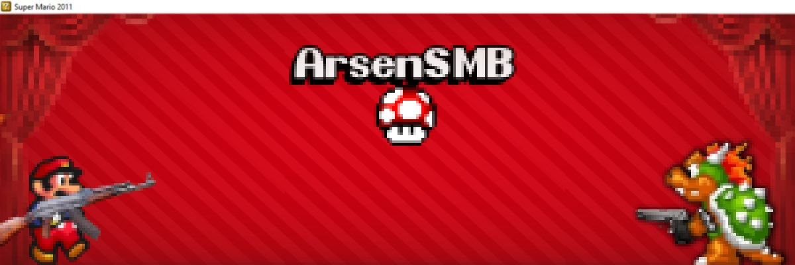
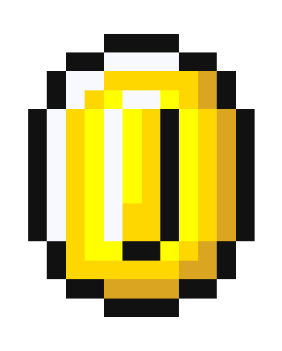
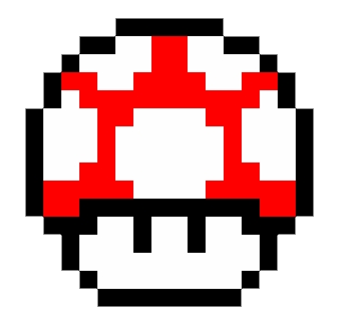

# SMB2011-fan-episodes
# 🍄 Hi everyone I'm Arseniy Volkov 

*17-year-old level designer, born in a "booming" city, and raised in hell. (just kiddin)*

---

### 🕹️ About Me & My Grind

Right now, I'm fully focused on creating custom episodes for the fan-made **Super Mario 2011**. I basically playtest my own maps **24/7**, balancing between standard, well-polished levels and hardcore, kaizo/bug-abusing madness. The grind never stops! 🛑

Before this, I built stuff in **Mario Worker** and messed around with several other non-Mario level editors. Since I'm only 17, I'm still very much in the learning phase, but I'm loving every bit of it.

---

### 🧠 What’s the Point of All This?

Briefly, this journey gives me hands-on experience in:
* 🗺️ **Level Construction** – Mastering pacing, difficulty curves, and player flow.
* 🧪 **Playtesting** – Breaking my own maps to make sure they are glitch-perfect.
* 🎨 **Graphic Design** – Currently surviving on *IbisPaint* to whip up custom backgrounds and floor textures.
* 💡 **Creativity** – Finding ways to unleash my ideas and bring them to life despite heavily limited tools.

---

### 🛠️ My Toolbox

I work with classic level editors that are, honestly, pretty limited. Aside from using *IbisPaint* for some custom tile work,  **everything is built straight inside the editor's constraints.** Turning limitations into features is my favorite challenge!

---

### 📦 Installation Guide

📖 Click here to see how to install the episodes

1. **Download the Base Game:** First, get the official Super Mario 2011 engine here: [Official Legacy Site](http://legacy.pi-dev.com/super-mario)
   * *Heads-up:* The site uses HTTP (unsecured) and your PC might scream that it's a virus. It's a **false positive** due to lack of digital signatures. The files are 100% safe, no malware here.
2. **Download my episodes** from the links in the section below.
3. **Move** the unpacked folders directly to this directory:  
   `Data` ➜ `Levels`
4. **Launch** the game, head over to the **"Episodes"** section, and my custom levels will be ready to play!

> ⚠️ **CRITICAL NOTE:** If you don't place the folders strictly inside the `Levels` directory, the game will completely fail to detect them. Make sure the path is correct!

---

  

### 🔗 Oi let's play lad

🎞️ **Feel free to watch my own Gameplays:** [My YouTube Channel](https://youtube.com)

📥 **Download My 3 Episodes:**
* 🏛️ [Greek Alphabet Episode](https://www.mediafire.com/file/fw6lzqy2807x9ja/Greekalphabet_SMB2011.rar/file)
* ⚡ [Mario Forever Flash Episode](https://www.mediafire.com/file/gfw4jl2p11ixen5/mario_foreverflash_SMB2011.rar/file)
* 🌟 [Mario Forever Episode](https://www.mediafire.com/file/8mmhry9u9y977rr/mario_forever_SMB2011.rar/file)
